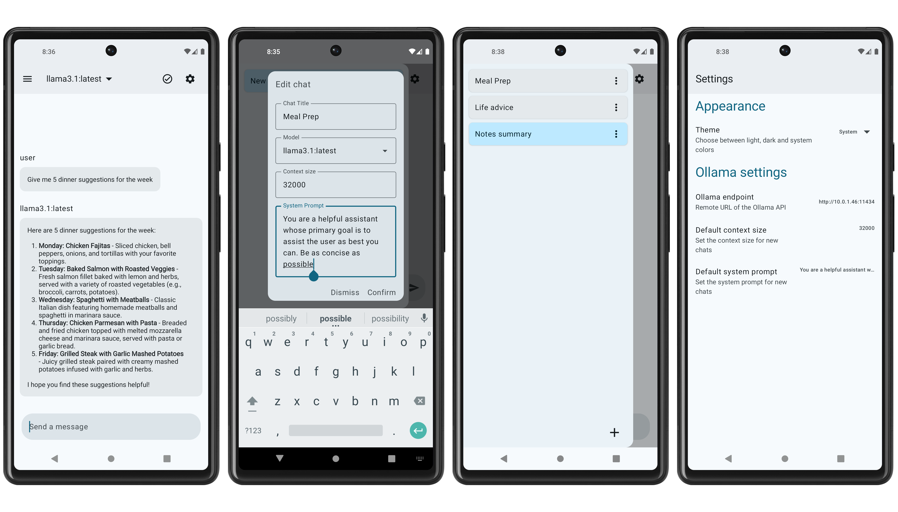

# LLamaClient
An Android client to communicate with LLMs hosted with an Ollama server.

## Usage
Build with [Android Studio](https://developer.android.com/studio) or grab a `.apk` from the [Releases](https://github.com/willfarris/LlamaClient/releases) section.

Add the URL of your Ollama instance to the `Ollama endpoint` setting within the settings of the app. *Note: Currently the app requires a restart when the endpoint URL is changed*

## Features
* Message history
* Per-chat context size, system prompt, and preferred model
* Periodic server health checks
* View the list of models loaded into memory

## Planned Features
* Regenerate user messages or responses from the server
* Chat edit/deletion functionality